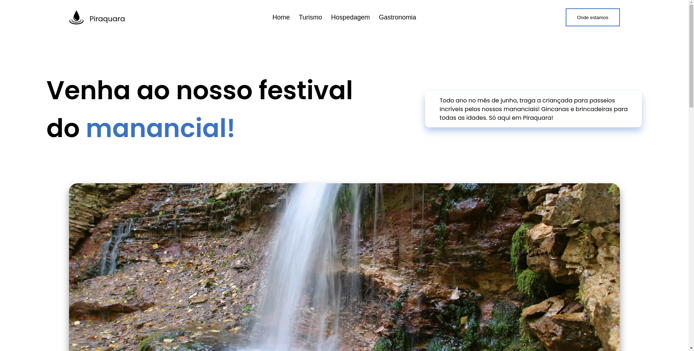

<h1 align="center">PUCPR - Pró-Metrópole</h1>

This is a web project made with HTML, CSS and JavaScript for studying purposes

</img>

### Tools

The following tools have been used in the project:

- [HTML](https://html.com/)
- [CSS](https://developer.mozilla.org/pt-BR/docs/Web/CSS)
- [JavaScript](https://www.javascript.com/)
- [VS Code](https://code.visualstudio.com)
---

### Author
Made by Johan Stromberg :fire: 
 
And Nicole Guarnieri :shark: :hibiscus:

---
[Live Server](https://johanrecaman.github.io/pucpr-pro-metropole/)

<h4 align="center">
  🚧  Work In Progress...  🚧
</h4>
